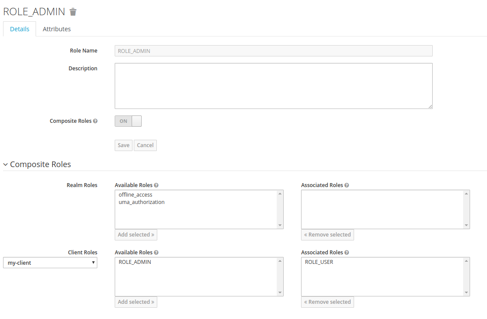

# Keycloak help guide

Go to http://localhost:8080/auth (or http://keycloak.docker/auth by default if you're using docker stack sample given in the main README)

Once in, go to Administration console and connect yourself with the default super admin user and password you've set in keycloak docker stack environment variables or in the welcome page if your using keycloak locally.

### Create a realm

First of all we want to create a new Realm for our project. Realms are designed to configure and provide limited scoped security solutions.

If it's the first time you're in keycloak you should be on the Master realm.

To create a realm from the Administration UI, go to ```Realm list > Add realm```


He should appear in the realm list after creation.

### Create a client

Then you must defined a client that will configure the scope of our application security.

Make sure you already are in your newly created realm and create a new client by going in ```Configure > Clients > Create```.


Once created, you can configure it by going in ``` Configure > Clients > [Your client]```

Here is a sample configuration that work with our bundle :


### Create roles

In keycloak, roles are an abstration of permissions for our application (used in security.yaml).

We want to define two default role for test purposes in the client configuration : one for admin (ROLE_ADMIN) and one for user (ROLE_USER).

You can configure it in ```Configure > Clients > [Your client] > Roles```


Make sure to have make ADMIN_ROLE a composite role of USER_ROLE to inherit permissions for your client (you must create them before).



### Activate user mappers

Mapper are used to retrieve information from keycloak about the user (ex: email, firstname, address, ...).

MAppers are available in ```Configure > Clients > [Your client] > Mappers```

You should have activate these mappers:


We advise you tu use builtin mappers, that are already configured.

### Create users

To create user go to ```Manage > Users > Add user```


#### Define a new password

When you create a user, he doesn't have a password.

To defined one, go to ```Manage > Users > View all users > admin > Credentials```


Note: If you want to make the password fixed you must disable the "Temporary" option.

#### Affect a role

Now we can affect roles we created before to the new user.

To add role, go to ```Manage > Users > View all users > admin > Role Mappings```. You must specify the client the user has access to.


### Export/Import

The Admin UI doesn't care about users when exporting so we must use a script provided by keycloak ([for more information](https://www.keycloak.org/docs/2.5/server_admin/topics/export-import.html))

#### Keycloak locally installed

You can export with this command:

```shell
$ path/to/keycloak/bin/standalone.sh \
    -Dkeycloak.migration.action=export \
    -Dkeycloak.migration.provider=singleFile \
    -Dkeycloak.migration.realmName=MyRealm \
    -Dkeycloak.migration.usersExportStrategy=REALM_FILE \
    -Dkeycloak.migration.file=/tmp/realm.json \
    -Djboss.http.port=8888 \
    -Djboss.https.port=9999 \
    -Djboss.management.http.port=7777
```

And import with this command:

```shell
$ path/to/keycloak/bin/standalone.sh \
    -Dkeycloak.migration.action=import \
    -Dkeycloak.migration.provider=singleFile \
    -Dkeycloak.migration.file=/tmp/realm.json \
    -Dkeycloak.import=/tmp/realm.json \
    -Dkeycloak.migration.strategy=OVERWRITE_EXISTING \
    -Djboss.http.port=8888 \
    -Djboss.https.port=9999 \
    -Djboss.management.http.port=7777
```

#### Docker

We will use the Makefile provided in the [sample docker stack](./Resources/docs/example).

You can export with this command:

```shell
$ make export realm="MyRealm"
```

And import with this command:

```shell
$ make import realm="MyRealm"
```
